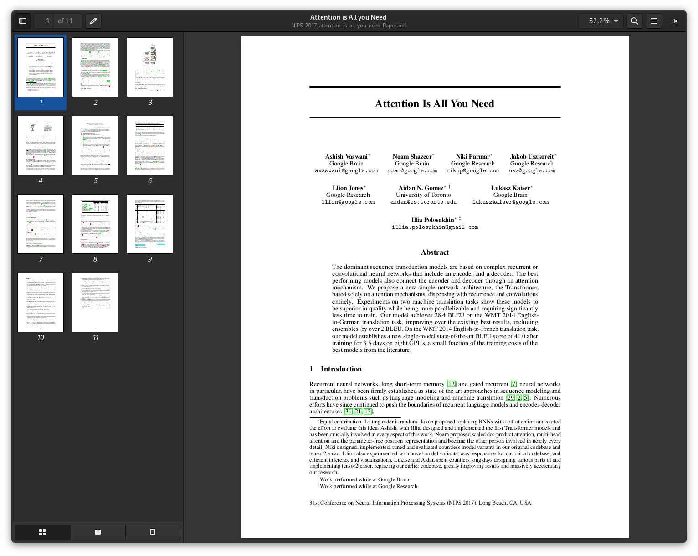
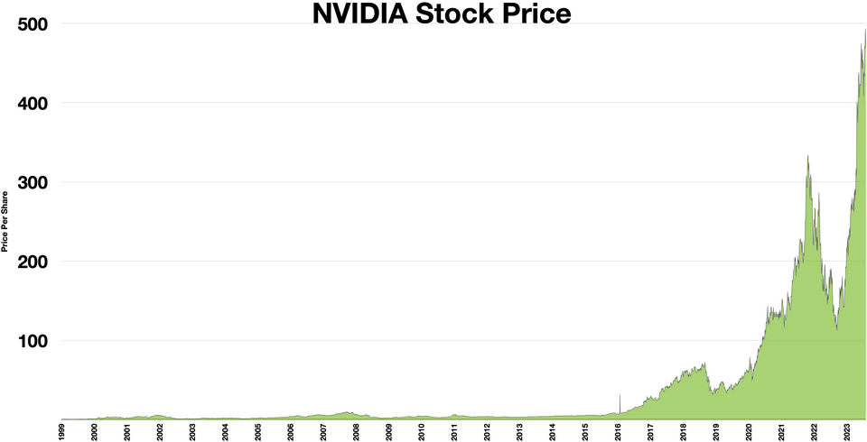
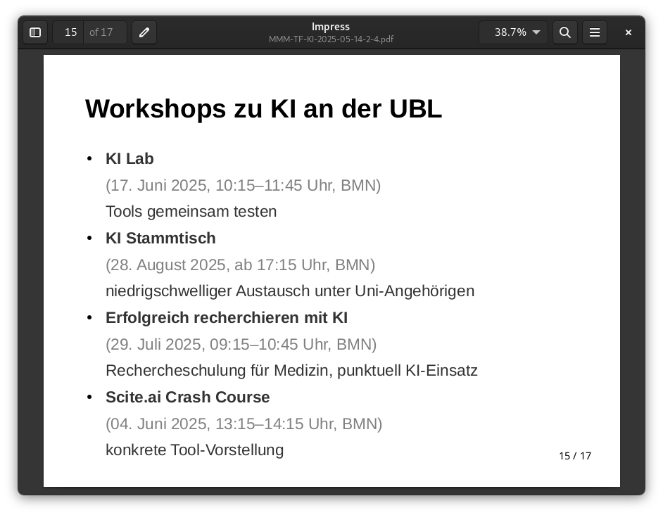

# Libraries and AI (5/2025)

> 2025-05-20, 12:30, Martin Czygan -- UBL FAMI VISIT

## Disclaimer

Generative AI is experimental and, compared to classical software, less
controllable (probabilistic); for everything that requires exact data and
transactions, it is initially not suitable.

> The more it [the AI model] reasons, the more unpredictable it becomes." - Ilya Sutskever, NeurIPS 2024

Random publication: [Generating Text with RNN](https://icml.cc/2011/papers/524_icmlpaper.pdf), 2011, Experiments

NYT model:

> while he was giving attention to the second advantage of school building a >
> 2-for-2 stool killed by the Cultures saddled with a half- suit defending the
> Bharatiya Fernall ’s office . Ms . Claire Parters will also have a history
> temple for him to raise jobs until naked Prodiena to paint baseball partners,
> provided people to ride both of Manhattan in 1978 , but what was largely
> directed to China in 1946 , focusing on the trademark period is the
> sailboat > yesterday and comments on whom they obtain overheard within
> the 120th > anniversary , where many civil rights defined , officials
> said early that > forms , ” said Bernard J. Marco Jr.  of Pennsylvania ,
> was monitoring New York

## The race and hype

The paper that ignited the current LLM developments was published in 2017
(2017-06-12, 2899 days ago) and has as of 2025-05-19 180523 citations accroding
to [Google
Scholar](https://scholar.google.com/scholar?q=Attention+is+all+you+need). On
average 62 citations of this paper per day.

If you sleep 8 hours a day and spend the rest of your day reading one paper per
hour (so 16 per day), you would spend the next **31 years** doing nothing that
reading research that would refer to this one paper alone.

> A primary origin of over-hyped AI capabilities is the fact that many AI
> systems are developed in sterile R&D environments and then deployed in more
> complex real-world set- tings without appropriate testing or oversight. --
> [Misrepresented Technological Solutions in Imagined Futures: The Origins and
> Dangers of AI Hype in the Research
> Community](https://arxiv.org/pdf/2408.15244) (2024)

FF.

> Designing effective and robust benchmark data sets for AI models is a
> challenging task, and mischaracterizing what a benchmark is designed to do is
> a significant contributor to AI hype.

## Current use cases

* [x] grammar checks, text critique ("human writing, machine feedback")
* [x] translations
* [x] generating code snippets, AI assisted software development
* [x] image editing (e.g. expand an image, remove artifacts)
* [x] brainstorming (e.g. for workshop themes)

We mostly do not generate images, nor raw text. We have enough images, and we
can and enjoy writing for our audience. Generated text can be shallow. More
code is not better, less code is better. We do not want to write more code than
we can read and understand.

## Current outreach

* meetups for [general public](https://www.ub.uni-leipzig.de/service/workshops-und-online-tutorials/schulungen/ki-stammtisch), and internal staff
* [workshops](https://www.ub.uni-leipzig.de/service/workshops-und-online-tutorials) for students, researchers

## Exploratory use cases

* [ ] optical character recognition (OCR)
* [ ] handwritten character recognition (HTR)
* [ ] metadata conversions utilities
* [ ] structured data extraction
* [ ] library as AI dataset curator

## Adjacent developments

* AI assisted search research tools and interfaces
* AI use of publishers, cf. [Publishers are selling papers to train AIs — and making millions of dollars](https://www.nature.com/articles/d41586-024-04018-5), $10M, $23M, ...
* open weights models hosted by public institutions for general use

## Resources

* [https://upload.wikimedia.org/wikipedia/commons/thumb/f/f6/NVIDIA_Stock_Price.webp/960px-NVIDIA_Stock_Price.webp.png](https://upload.wikimedia.org/wikipedia/commons/thumb/f/f6/NVIDIA_Stock_Price.webp/960px-NVIDIA_Stock_Price.webp.png)
