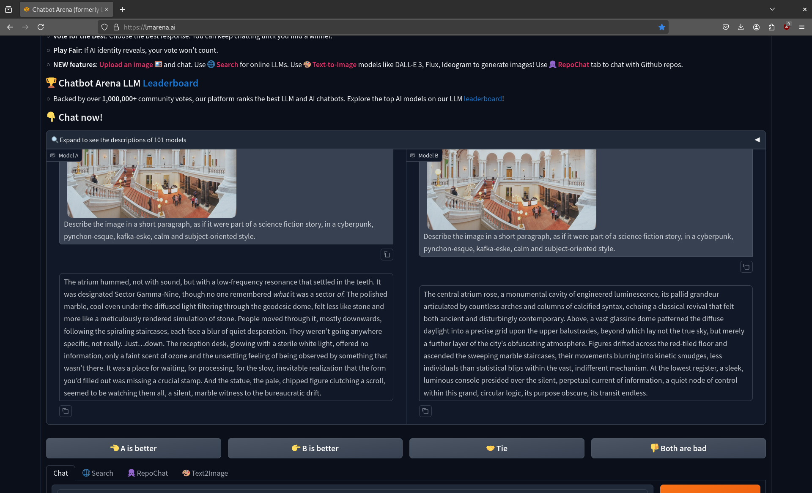

# Libraries and AI (5/2025)

> 2025-05-20, 12:30, Martin Czygan -- UBL FAMI VISIT

## Disclaimer

Generative AI is experimental and, compared to classical software, less
controllable (probabilistic); for everything that requires exact data and
transactions, it is initially not suitable.

> The more it [the AI model] reasons, the more unpredictable it becomes." - Ilya Sutskever, NeurIPS 2024

Random publication: [Generating Text with RNN](https://icml.cc/2011/papers/524_icmlpaper.pdf), 2011, Experiments

NYT model:

> while he was giving attention to the second advantage of school building a >
> 2-for-2 stool killed by the Cultures saddled with a half- suit defending the
> Bharatiya Fernall ’s office . Ms . Claire Parters will also have a history
> temple for him to raise jobs until naked Prodiena to paint baseball partners,
> provided people to ride both of Manhattan in 1978 , but what was largely
> directed to China in 1946 , focusing on the trademark period is the
> sailboat > yesterday and comments on whom they obtain overheard within
> the 120th > anniversary , where many civil rights defined , officials
> said early that > forms , ” said Bernard J. Marco Jr.  of Pennsylvania ,
> was monitoring New York

And going back to 1989:

## The race and hype

The paper that ignited the current LLM developments was published in 2017
(2017-06-12, 2899 days ago) and has as of 2025-05-19 180523 citations accroding
to [Google
Scholar](https://scholar.google.com/scholar?q=Attention+is+all+you+need). On
average 62 citations of this paper per day.

If you sleep 8 hours a day and spend the rest of your day reading one paper per
hour (so 16 per day), you would spend the next **31 years** doing nothing that
reading research that would refer to this one paper alone.

> A primary origin of over-hyped AI capabilities is the fact that many AI
> systems are developed in sterile R&D environments and then deployed in more
> complex real-world settings without appropriate testing or oversight. --
> [Misrepresented Technological Solutions in Imagined Futures: The Origins and
> Dangers of AI Hype in the Research
> Community](https://arxiv.org/pdf/2408.15244) (2024)

### More about hype and benchmarks

> Designing effective and robust benchmark data sets for AI models is a
> challenging task, and mischaracterizing what a benchmark is designed to do is
> a significant contributor to AI hype.

See also: [benchmarks](https://huggingface.co/spaces/open-llm-leaderboard/open_llm_leaderboard#/)

> To address this issue, we introduce Chatbot Arena, an open plat-
form for evaluating LLMs based on human pref- erences. Our methodology employs
a pairwise comparison approach and leverages input from a diverse user base
through crowdsourcing -- [Chatbot Arena: An Open Platform for Evaluating LLMs by Human Preference](https://arxiv.org/pdf/2403.04132)

Final question, do you remember [Galactica: A Large Language Model for Science](https://arxiv.org/abs/2211.09085)?

> Information overload is a major obstacle to scientific progress. The
> explosive growth in scientific literature and data has made it ever harder to
> discover useful insights in a large mass of information. Today scientific
> knowledge is accessed through search engines, but they are unable to organize
> scientific knowledge alone. In this paper we introduce Galactica: a large
> language model that can store, combine and reason about scientific knowledge.
> We train on a large scientific corpus of papers, reference material,
> knowledge bases and many other sources.

The paper dates from 2022-11-16, [two weeks before](https://en.wikipedia.org/wiki/ChatGPT) the ChatGPT preview.

> Galactica is a large language model for science, trained on 48 million
> examples of scientific articles, websites, textbooks, lecture notes, and
> encyclopedias. Meta promoted its model as a shortcut for researchers and
> students. In the company’s words, Galactica “can summarize academic papers,
> solve math problems, generate Wiki articles, write scientific code, annotate
> molecules and proteins, and more.” -- [Why Meta’s latest large language model
> survived only three days
> online](https://www.technologyreview.com/2022/11/18/1063487/meta-large-language-model-ai-only-survived-three-days-gpt-3-science/)
> (2022-11-18); cf. [Meta Galactica
> eingestellt](https://www.zdnet.de/88405189/meta-galactica-eingestellt/)

## Context switch

The Atrium processed data in a manner not unlike the human nervous system – a
constant flow of bodies ascending and descending the twin staircases, each a
vector of intent, though the intent itself remained stubbornly unreadable.
[...] -- [[Gemma-3-27B-Instruct](https://arxiv.org/pdf/2503.19786), via
[GWDG](https://arxiv.org/pdf/2407.00110)]

## Current use cases

* [x] grammar checks, text critique ("human writing, machine feedback")
* [x] translations
* [x] generating code snippets, AI assisted software development
* [x] image editing (e.g. expand an image, remove artifacts)
* [x] brainstorming (e.g. for workshop themes)

We mostly do not generate images, nor raw text. We have enough images, and we
can and enjoy writing for our audience. Generated text can be shallow. More
code is not better, less code is better. We do not want to write more code than
we can read and understand.

## Current outreach

* [x] meetups for [broader audience](https://www.ub.uni-leipzig.de/service/workshops-und-online-tutorials/schulungen/ki-stammtisch), and staff
* [x] [workshops](https://www.ub.uni-leipzig.de/service/workshops-und-online-tutorials) for students, researchers

## Exploratory use cases (Ex)

* [ ] optical character recognition (OCR)
* [ ] handwritten character recognition (HTR)
* [ ] metadata conversions utilities
* [ ] code refactoring
* [ ] structured data extraction
* [ ] library as AI dataset curator

## Adjacent developments

* AI assisted search research tools and interfaces, cf. [Review of Scopus AI](https://scholarlykitchen.sspnet.org/2024/02/21/guest-post-there-is-more-to-reliable-chatbots-than-providing-scientific-references-the-case-of-scopusai/)
* AI use of publishers, cf. [Publishers are selling papers to train AIs — and making millions of dollars](https://www.nature.com/articles/d41586-024-04018-5), $10M, $23M, ...
* open weights models hosted by public institutions for general use, [Chat-AI](https://docs.hpc.gwdg.de/services/chat-ai/index.html)

## Ex: document parsing (ocr, htr)

* preparing text documents to feed into LLM became a major problem
* toolkits existed before, e.g. [Apache Tika](https://tika.apache.org/)
* newer libraries: [docling](https://github.com/docling-project/docling), [markitdown](https://github.com/microsoft/markitdown)

There is a drift towards preparing X for LLM, e.g. [gitingest](https://gitingest.com/), and surely many more

## Ex: metadata conversion utilities

Given examples of input and output data pairs, write a program that converts one schema to another.

## Ex: code refactoring

Latest feature, added zstd support for [metha](https://github.com/ubleipzig/metha), a metadata harvesting tool.

## Ex: structured data extraction

Example parsing references from raw strings using local models: [unstructured](https://github.com/miku/localmodels/tree/main/tasks/unstructured)

## Ex: library as dataset curator

* GLAM data is already available, cf. [Coding da Vinci](https://codingdavinci.de/) ([2018 an der UB](https://blog.ub.uni-leipzig.de/tag/coding-da-vinci/))
* images, text, metadata, data/image pairs, annotated images and more

## Ideas

### Log your prompts and conversations

* keep a log of your conversations, as it is not clear yet, what prompt works best (for which task, model, version)

> Prompt engineering is the **art** of asking the right question to get the
> best output from an LLM. It enables direct interaction with the LLM using
> only plain language prompts.

> In the past, working with machine learning models typically required deep
> knowledge of datasets, statistics, and modeling techniques. Today, LLMs can
> be "programmed" in English, as well as other languages. -- [Prompt Engineering for Generative AI](https://developers.google.com/machine-learning/resources/prompt-eng)

You can export your conversations with various browser extensions or use a
desktop client application, e.g. open source
[ChatBox](https://chatboxai.app/en), [LM studio](https://lmstudio.ai/), ...

> Q: What application do you use?

### Custom Benchmarks

* in order to understand and compare model performance, one would need to have **benchmarks**, that are specific to our concrete tasks
* there are many existing benchmarks, see [here](https://github.com/leobeeson/llm_benchmarks), and [here](https://www.evidentlyai.com/llm-evaluation-benchmarks-datasets)

## Resources

* [https://upload.wikimedia.org/wikipedia/commons/thumb/f/f6/NVIDIA_Stock_Price.webp/960px-NVIDIA_Stock_Price.webp.png](https://upload.wikimedia.org/wikipedia/commons/thumb/f/f6/NVIDIA_Stock_Price.webp/960px-NVIDIA_Stock_Price.webp.png)

